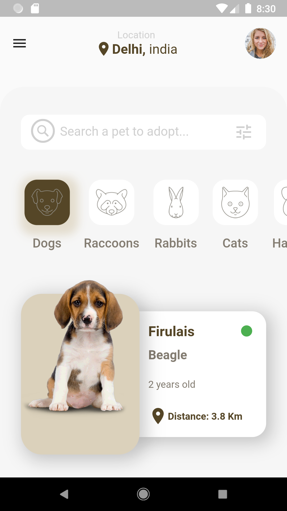

<h1><b>Taller de Flutter Basico</b></h1>

Esta práctica fue realizada en vivo a traves de un taller que dicte en vivo en mi canal de discord [Locos por Flutter y Dart](https://discord.gg/KkY42c7AGV), el fin de este taller es ayudar a las personas nuevas en **Flutter** a conocer de una forma mas amigable como poder realizar **Front-End**  de forma correcta y bien estructurada.

    Nota: Este repositorio estara en constante cambio ya que se realizaran varios talleres donde se irán sumando nuevos conceptos como, animaciones, Getx, logica del negocio entre otros.

Resultado final.

